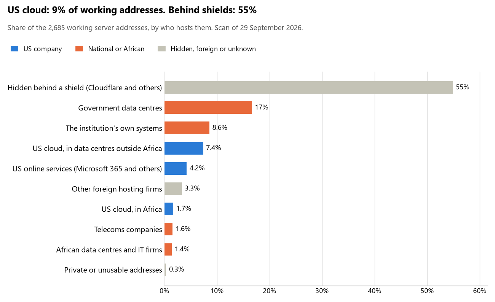

# Uganda: who hosts the state's front door

29 September 2026 · Bill Anderson · scan of 29 September 2026

The scan covered 36 state bodies, banks and state-owned companies in Uganda. 9% of their working server addresses are on US cloud: Amazon, Microsoft, Google or Oracle. 55% are behind shields such as Cloudflare, which hide the host. 25% are on government data centres or the institutions' own systems.

The scan found 2,491 web and mail names and 2,685 working addresses. 19 of the 36 institutions use US cloud for at least part of their estate. 13 use Microsoft for email and 1 use Google.

Of the 54 countries scanned so far, Uganda has the 41st highest US cloud share (median 13%) and the 2nd highest share behind shields (median 12%).

## Where it lives

243 addresses are on US cloud. Where they are: 39% in Europe, 28% on worldwide delivery networks (no fixed location), 19% in Africa, 11% in North America and 3% in a region the providers do not publish.

1,474 addresses are behind shields: Cloudflare (96%), Akamai (2%) and Radware (1%). The host behind a shield cannot be seen, so the US cloud share is a minimum.

## Banks against government

| Share of working addresses | Government (30) | Banks (6) |
| --- | --- | --- |
| On US cloud | 6% | 27% |
| …of which in Africa | <1% | 10% |
| US online services (Microsoft 365 and others) | 4% | 4% |
| Behind a shield | 55% | 54% |
| Government data centres | 19% | 0% |
| Run by the institution itself | 9% | 8% |
| Telecoms companies | 1% | 2% |
| African data centres and IT firms | 1% | 3% |
| Other foreign hosting firms | 4% | 2% |

4 of 6 banks and 15 of 30 government bodies use US cloud somewhere. "Government" includes the central bank, the payment switch, the stock exchange and the state-owned companies.

## Email

13 of the 36 institutions use Microsoft 365 for email and 1 use Google.

- **Microsoft 365:** 13. Parliament of Uganda, Uganda Police Force, Judiciary of Uganda, Bank of Uganda, Centenary Bank, dfcu Bank, Housing Finance Bank, National Identification and Registration Authority, Uganda Bureau of Statistics, Uganda Securities Exchange, National Social Security Fund, Uganda Communications Commission and Inspectorate of Government.
- **Google:** 1. Office of the Auditor General.
- **Government data centre (National Information Technology Authority Uganda):** 17. State House Uganda, Ministry of Foreign Affairs, Ministry of Defence and Veteran Affairs, Uganda People's Defence Force, Ministry of Justice and Constitutional Affairs, Ministry of Finance Planning and Economic Development, Ministry of Internal Affairs, Personal Data Protection Office, Electoral Commission of Uganda, Directorate of Citizenship and Immigration Control, Ministry of Health, Ministry of Gender Labour and Social Development, Ministry of Lands Housing and Urban Development, Capital Markets Authority, Public Procurement and Disposal of Public Assets Authority, Uganda Electricity Transmission Company and Uganda National CERT/CC.
- **Own mail servers:** 2. Uganda Revenue Authority and National Information Technology Authority Uganda.
- **Not identified:** 1. Bank of Baroda Uganda.
- **No mail on the domain scanned:** 2. Stanbic Bank Uganda and Absa Bank Uganda.

## Institution by institution

Each figure is a share of that institution's working addresses. The rest are with telecoms companies, African data centres, US online services or foreign hosts. Rows follow the order of institution types.

| Institution | Type | On US cloud | …in Africa | Behind a shield | Own or government | Email |
| --- | --- | --- | --- | --- | --- | --- |
| State House Uganda | Presidency | 0% | 0% | 98% | 2% | Government |
| Parliament of Uganda | Parliament | 6% | 2% | 0% | 55% | Microsoft |
| Ministry of Foreign Affairs | Foreign Affairs | 0% | 0% | 99% | 1% | Government |
| Ministry of Defence and Veteran Affairs | Defence | 20% | 10% | 0% | 40% | Government |
| Uganda People's Defence Force | Armed Forces | 33% | 8% | 0% | 33% | Government |
| Uganda Police Force | Police | 0% | 0% | 0% | 52% | Microsoft |
| Ministry of Justice and Constitutional Affairs | Justice | 0% | 0% | 96% | 4% | Government |
| Judiciary of Uganda | Justice | 20% | 10% | 0% | 20% | Microsoft |
| Ministry of Finance Planning and Economic Development | Treasury / Finance | 1% | 0% | 49% | 49% | Government |
| Uganda Revenue Authority | Revenue Service | 20% | 2% | 0% | 63% | Own servers |
| Ministry of Internal Affairs | Interior / Home Affairs | 8% | 0% | 43% | 46% | Government |
| Bank of Uganda | Central Bank | 23% | 0% | 0% | 56% | Microsoft |
| Stanbic Bank Uganda | Commercial Banks | 33% | 5% | 60% | 0% | — |
| Centenary Bank | Commercial Banks | 0% | 0% | 0% | 91% | Microsoft |
| dfcu Bank | Commercial Banks | 75% | 75% | 6% | 16% | Microsoft |
| Absa Bank Uganda | Commercial Banks | 14% | 0% | 40% | 20% | — |
| Housing Finance Bank | Commercial Banks | 7% | 4% | 75% | 4% | Microsoft |
| Bank of Baroda Uganda | Commercial Banks | 0% | 0% | 60% | 0% | Not identified |
| National Identification and Registration Authority | Civil registry / National ID authority | 0% | 0% | 15% | 30% | Microsoft |
| Personal Data Protection Office | Data protection authority | 0% | 0% | 8% | 48% | Government |
| Electoral Commission of Uganda | Electoral commission | 0% | 0% | 97% | 3% | Government |
| Uganda Bureau of Statistics | Statistics office | 56% | 2% | 0% | 18% | Microsoft |
| Directorate of Citizenship and Immigration Control | Immigration / Passports | 0% | 0% | 85% | 15% | Government |
| Ministry of Health | Health ministry / National health insurance | 0% | 0% | 89% | 11% | Government |
| Ministry of Gender Labour and Social Development | Social protection / Social registry | 0% | 0% | 19% | 78% | Government |
| Ministry of Lands Housing and Urban Development | Land registry | 0% | 0% | 0% | 94% | Government |
| Uganda Securities Exchange | Stock exchange | 0% | 0% | 0% | 0% | Microsoft |
| Capital Markets Authority | Securities regulator | 25% | 8% | 0% | 33% | Government |
| National Social Security Fund | Sovereign wealth fund / National pension fund | 53% | 0% | 7% | 18% | Microsoft |
| Public Procurement and Disposal of Public Assets Authority | Public procurement authority | 18% | 5% | 0% | 59% | Government |
| Uganda Electricity Transmission Company | Energy utility | 0% | 0% | 0% | 100% | Government |
| National Information Technology Authority Uganda | E-government agency | 0% | 0% | 22% | 71% | Own servers |
| Uganda National CERT/CC | Cybersecurity agency / National CERT | 0% | 0% | 96% | 3% | Government |
| Uganda Communications Commission | Communications regulator | 30% | 0% | 0% | 39% | Microsoft |
| Office of the Auditor General | Audit office | 18% | 6% | 0% | 76% | Google |
| Inspectorate of Government | Anti-corruption commission | 35% | 0% | 0% | 0% | Microsoft |

No institution or working domain was found for 6 of the 36 types: Customs, Intelligence, National payment switch, Ports authority, State-owned telco / National backbone operator and National data centre / Government cloud operator.

## What stood out

- **Most on US cloud.** dfcu Bank (75%), Uganda Bureau of Statistics (56%) and National Social Security Fund (53%) have more than half their working addresses on US cloud.
- **US cloud in Africa.** dfcu Bank has 75% of its working addresses in US cloud data centres in Africa, the highest share in Uganda.
- **Core state bodies on foreign hosting firms.** Ministry of Defence and Veteran Affairs (Hetzner), Uganda People's Defence Force (Hetzner), Uganda Police Force (DigitalOcean and Contabo), Judiciary of Uganda (Hetzner), Uganda Revenue Authority (Cloud (SoftLayer)) and Ministry of Internal Affairs (Akamai Connected Cloud (Linode)), and 1 more.
- **No Chinese cloud.** The scan found no address on Huawei, Alibaba or Tencent cloud.
- **Names anyone could claim.** One web address at Stanbic Bank Uganda points at a deleted cloud name that anyone could register and then publish under. We have flagged it and do not name it here.

## What this can and cannot tell you

The scan sees only the front door: websites, email, login portals, remote-access gateways and online banking. It cannot see where a bank's core ledger, the ID register or the payroll run.

- **Every US figure is a minimum.** Anything behind a shield or a mail filter could also be on US cloud. In Uganda that is 55% of working addresses.
- **It counts addresses, not importance.** An institution with many test and marketing sites weighs more than one with few.
- **The list of institutions was drawn up for this scan.** Each domain was checked to exist, not confirmed as the institution's main one.
- **It is a snapshot.** Every figure is as of 29 September 2026.
- **Nothing was touched.** The scan used public address lookups, public certificate records and the cloud companies' published address lists. It never connected to any institution's systems.

The data and method are in `R&D/Hyperscaler-dependence/scan/UGA/` and `R&D/Hyperscaler-dependence/HYPERSCALER-SCAN.md` in the Corpus repository.
