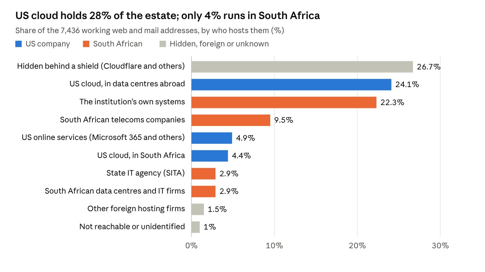

# South Africa: who hosts the state's front door

28 September 2026 · Bill Anderson

Just over a quarter (28%) of the public-facing systems of 49 South African state bodies, banks and utilities run on Amazon, Microsoft, Google or Oracle. Only about one sixth of that is hosted in South Africa itself. Another quarter sits behind Cloudflare and similar shields, so we can't see who hosts it. Another quarter is run by the institutions themselves or by the state's own IT agency, SITA.

The scan covered the government's main ministries and agencies, the ten largest banks, the payment switch, the stock exchange and the big state-owned companies. It found 12,666 web and mail addresses, of which 7,436 lead to a working server. 43 of the 49 institutions use a US cloud provider for at least part of their public estate. 30 of them use Microsoft for email.

## Where it lives

Most of the US share is not really "a data centre". More than half of it is Amazon's and Microsoft's worldwide delivery networks, which put a copy of a website close to each visitor. Of the rest, Europe hosts about 540 addresses and South Africa about 330. The European ones are mostly in Microsoft's Dublin and Amsterdam data centres and Amazon's in Ireland and Frankfurt. The US itself hosts almost none.

The "shield" quarter is the part we cannot see into. Cloudflare and similar firms sit in front of a website to absorb attacks, and they hide the server behind them. Those servers could be anywhere, including on US cloud, so the 28% is a floor, not a ceiling.

## Banks against government

Banks and the state lean on US cloud about equally, but banks run far more of their own systems. The state leans more on telecoms companies and on SITA.

| Share of working addresses | Government (39 bodies) | Banks (10) |
| --- | --- | --- |
| On US cloud | 27% | 30% |
| …of which hosted in South Africa | 3% | 5% |
| Hidden behind a shield | 26% | 27% |
| Run by the institution itself | 11% | 30% |
| Run by SITA, the state IT agency | 7% | — |
| Run by South African telecoms companies | 13% | 7% |

"Government" here includes the Reserve Bank, the payment switch, the stock exchange and the state-owned companies (Eskom, Transnet, Telkom and others). Every one of the ten largest banks uses US cloud somewhere; so do 33 of the 39 government bodies.

## Email

Microsoft carries the email of 30 of the 49 institutions, and Google carries none. Email is a fair proxy for the office: a body on Microsoft 365 for mail usually keeps its documents and calendars there too.

- **Microsoft 365:** 30, including National Treasury, SARS, the Police, Justice, DIRCO, Parliament and eight of the ten banks.
- **Behind a mail filter, provider unseen:** 10. Mimecast, a British firm, screens the mail and hides what sits behind it. They include the Reserve Bank, Stats SA, the Electoral Commission, the Department of Health and Telkom.
- **South African providers:** 5. Defence and the State Security Agency use Telkom. Home Affairs and SITA use Dimension Data. The Cybersecurity Hub uses TENET, the universities' network.
- **Their own mail servers:** FirstRand (FNB), and the government portal through SITA.
- **No mail on the domain scanned:** 2. The Presidency's mail runs on a different domain, and the Deeds Office domain is broken (see below).

Mimecast screens mail for 24 of the 49 in all, whichever provider sits behind it.

## Institution by institution

TymeBank, National Treasury and the Public Investment Corporation lean hardest on US cloud. Stats SA, the Electoral Commission, Investec, the JSE and Eskom hide most of their estate behind a shield. Each figure is a share of that institution's working addresses. Whatever a row does not add up to sits with South African telecoms companies and data centres, US online services, or foreign hosts. FirstRand and Absa each appear twice because each runs two main domains.

| Institution | Sector | On US cloud | …of which in SA | Behind a shield | Own or SITA | Email |
| --- | --- | --- | --- | --- | --- | --- |
| TymeBank | Bank | 91% | 2% | 1% | 0% | Microsoft |
| National Treasury | Government | 74% | 1% | 1% | 18% | Microsoft |
| Public Investment Corporation | Government | 64% | 15% | 0% | 0% | Microsoft |
| ICASA | Government | 57% | 26% | 3% | 0% | Microsoft |
| Bidvest Bank | Bank | 56% | 5% | 5% | 0% | Microsoft |
| Sentech | Government | 54% | 0% | 9% | 24% | Filtered (Mimecast) |
| Absa | Bank | 53% | 29% | 6% | 34% | Microsoft |
| Telkom | Government | 49% | 2% | 0% | 39% | Filtered (Mimecast) |
| Nedbank | Bank | 48% | 7% | 0% | 3% | Microsoft |
| African Bank | Bank | 46% | 2% | 38% | 9% | Microsoft |
| Financial Sector Conduct Authority | Government | 43% | 5% | 0% | 0% | Microsoft |
| State Security Agency | Government | 43% | 0% | 0% | 0% | Telkom |
| Payments Association (PASA) | Government | 39% | 0% | 0% | 0% | Filtered (Mimecast) |
| BankservAfrica | Government | 38% | 1% | 0% | 12% | Microsoft |
| eTender portal | Government | 38% | 0% | 0% | 22% | Microsoft |
| Absa (absa.africa) | Bank | 36% | 26% | 13% | 10% | Microsoft |
| Foreign Affairs (DIRCO) | Government | 33% | 5% | 0% | 5% | Microsoft |
| Government Employees Pension Fund | Government | 33% | 0% | 7% | 0% | Filtered (Mimecast) |
| Cybersecurity Hub | Government | 31% | 0% | 0% | 10% | TENET |
| South African Reserve Bank | Government | 28% | 24% | 0% | 65% | Filtered (Mimecast) |
| Discovery Bank | Bank | 28% | 2% | 16% | 30% | Microsoft |
| SITA (state IT agency) | Government | 28% | 0% | 0% | 68% | Dimension Data |
| Judiciary (Office of the Chief Justice) | Government | 26% | 5% | 0% | 55% | Filtered (Mimecast) |
| South African Police Service | Government | 26% | 0% | 0% | 71% | Microsoft |
| Broadband Infraco | Government | 25% | 0% | 6% | 19% | Microsoft |
| Department of Home Affairs | Government | 24% | 2% | 0% | 71% | Dimension Data |
| Special Investigating Unit | Government | 21% | 2% | 0% | 0% | Microsoft |
| Standard Bank | Bank | 21% | 1% | 55% | 22% | Microsoft |
| Department of Justice | Government | 20% | 0% | 0% | 0% | Microsoft |
| Information Regulator | Government | 20% | 0% | 0% | 7% | Microsoft |
| National Department of Health | Government | 12% | 12% | 0% | 2% | Filtered (Mimecast) |
| FNB | Bank | 10% | 4% | 2% | 74% | Own servers |
| Capitec Bank | Bank | 10% | 0% | 4% | 82% | Microsoft |
| Eskom | Government | 10% | 0% | 75% | 14% | Microsoft |
| Transnet | Government | 9% | 5% | 26% | 3% | Microsoft |
| Johannesburg Stock Exchange | Government | 8% | 0% | 79% | 10% | Microsoft |
| Communications and Digital Technologies | Government | 8% | 0% | 0% | 75% | Microsoft |
| Public Protector | Government | 6% | 0% | 0% | 42% | Microsoft |
| Auditor-General of South Africa | Government | 5% | 4% | 0% | 0% | Microsoft |
| Electoral Commission (IEC) | Government | 5% | 0% | 87% | 0% | Filtered (Mimecast) |
| Department of Social Development | Government | 4% | 2% | 0% | 64% | Microsoft |
| Investec | Bank | 4% | 0% | 82% | 9% | Filtered (Mimecast) |
| South African Revenue Service | Government | 3% | 2% | 60% | 0% | Microsoft |
| Statistics South Africa | Government | 2% | 0% | 95% | 1% | Filtered (Mimecast) |
| The Presidency | Government | 0% | 0% | 0% | 40% | — |
| Parliament | Government | 0% | 0% | 0% | 0% | Microsoft |
| Defence and SANDF | Government | 0% | 0% | 0% | 7% | Telkom |
| FirstRand | Bank | 0% | 0% | 0% | 77% | Filtered (Cisco) |
| SASSA | Government | 0% | 0% | 0% | 0% | Microsoft |
| Government portal (gov.za) | Government | 0% | 0% | 0% | 56% | SITA |
| Deeds Office (Land Reform) | Government | — | — | — | — | — |

## What stood out

- **The Presidency's website is on a commercial web host.** It runs on Xneelo, a South African hosting firm, not on SITA or government servers. Its State of the Nation site runs on DigitalOcean, a US hosting company.
- **The Government Employees Pension Fund's website is on budget shared hosting.** It sits with Hostinger, a Lithuanian firm selling low-cost hosting to the public.
- **One Eskom web address points at a domain that has lapsed.** The outside domain it relies on is now held by a domain-parking firm. Whoever takes that domain over could publish content under an Eskom address. We have flagged it and are not naming the address here.
- **The Deeds Office's domain no longer works.** Every lookup fails. Earlier the same day its homepage was seen showing Indonesian gambling content. The department was restructured in 2024, and the scan should move to its successor's domain.
- **Those that use US cloud inside South Africa are few.** The Reserve Bank, Absa and ICASA each keep about a quarter of their estate in Amazon's or Microsoft's South African data centres. The rest use Amazon's and Microsoft's worldwide delivery networks or their European data centres.

## What this can and cannot tell you

The scan sees only the front door. That means websites, email, login portals, remote-access gateways and online banking. It cannot see where a bank's core ledger, the population register or the payroll actually run, and for banks those are mostly in their own data centres.

- **Every US figure is a floor.** Anything behind Cloudflare or a mail filter could also be on US cloud, and we cannot tell.
- **It counts addresses, not importance.** A bank with 400 test and marketing sites weighs more than a ministry with 20, whatever those sites do.
- **It is a snapshot.** Every figure is as of 28 September 2026. Running the scan again in a year shows which way each institution is moving.
- **Nothing was touched.** The scan used public address lookups, public certificate records and the cloud companies' own published lists of their addresses. It never connected to any institution's systems.

The data and method are in `R&D/scan/ZAF/` and `R&D/HYPERSCALER-SCAN.md` in the Corpus repository.
