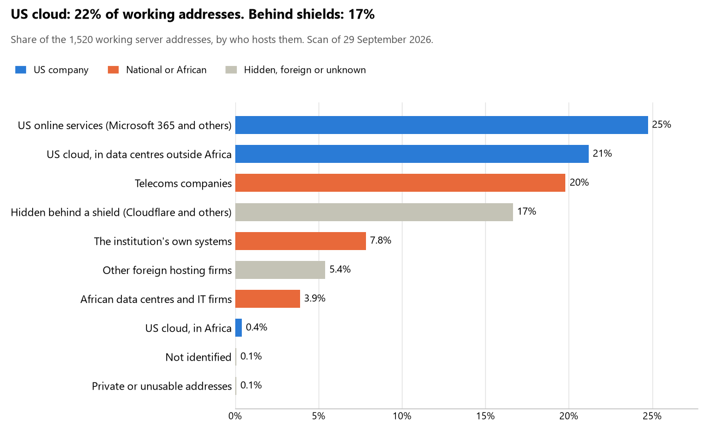

# Zambia: who hosts the state's front door

29 September 2026 · Bill Anderson · scan of 29 September 2026

The scan covered 37 state bodies, banks and state-owned companies in Zambia. 22% of their working server addresses are on US cloud: Amazon, Microsoft, Google or Oracle. 17% are behind shields such as Cloudflare, which hide the host. 8% are on government data centres or the institutions' own systems.

The scan found 942 web and mail names and 1,520 working addresses. 26 of the 37 institutions use US cloud for at least part of their estate. 30 use Microsoft for email and none use Google.

Of the 54 countries scanned so far, Zambia has the 13th highest US cloud share (median 13%) and the 19th highest share behind shields (median 12%).

## Where it lives

328 addresses are on US cloud. Where they are: 80% in Europe, 10% on worldwide delivery networks (no fixed location), 7% in a region the providers do not publish, 2% in Africa and <1% in North America.

253 addresses are behind shields: Cloudflare (79%), Akamai (13%) and Radware (5%). The host behind a shield cannot be seen, so the US cloud share is a minimum.

## Banks against government

| Share of working addresses | Government (30) | Banks (7) |
| --- | --- | --- |
| On US cloud | 21% | 24% |
| …of which in Africa | <1% | 0% |
| US online services (Microsoft 365 and others) | 28% | 16% |
| Behind a shield | 8% | 40% |
| Government data centres | 0% | 0% |
| Run by the institution itself | 8% | 7% |
| Telecoms companies | 26% | 2% |
| African data centres and IT firms | 5% | 2% |
| Other foreign hosting firms | 4% | 8% |

7 of 7 banks and 19 of 30 government bodies use US cloud somewhere. "Government" includes the central bank, the payment switch, the stock exchange and the state-owned companies.

## Email

30 of the 37 institutions use Microsoft 365 for email and none use Google.

- **Microsoft 365:** 30. State House, Ministry of Foreign Affairs, Ministry of Defence, Ministry of Justice, Ministry of Finance and National Planning, Zambia Revenue Authority, Ministry of Home Affairs and Internal Security, Bank of Zambia, Zambia National Commercial Bank (Zanaco), Stanbic Bank Zambia, First National Bank Zambia, Indo-Zambia Bank, Bancabc Zambia, First Capital Bank Zambia, Department of National Registration Passport and Citizenship, Zambia Statistics Agency, Department of Immigration, Ministry of Health, National Health Insurance Management Authority, Ministry of Community Development and Social Services, Ministry of Lands and Natural Resources, Zambia Electronic Clearing House, Lusaka Securities Exchange, National Pension Scheme Authority, Zambia Public Procurement Authority, ZESCO Limited, Smart Zambia Institute, Zambia Information and Communications Technology Authority, Office of the Auditor General and Anti-Corruption Commission.
- **Own mail servers:** 1. Zamtel.
- **Telecoms companies:** 3. National Assembly of Zambia (Hai Telecommunications Limited), Electoral Commission of Zambia (Hai Telecommunications Limited) and Securities and Exchange Commission Zambia (Zambia).
- **Foreign hosting firms:** 2. Zambia Police Service (Unified Layer) and Judiciary of Zambia (InMotion Hosting).
- **No mail on the domain scanned:** 1. Absa Bank Zambia.

## Institution by institution

Each figure is a share of that institution's working addresses. The rest are with telecoms companies, African data centres, US online services or foreign hosts. Rows follow the order of institution types.

| Institution | Type | On US cloud | …in Africa | Behind a shield | Own or government | Email |
| --- | --- | --- | --- | --- | --- | --- |
| State House | Presidency | 0% | 0% | 0% | 0% | Microsoft |
| National Assembly of Zambia | Parliament | 0% | 0% | 0% | 0% | Telecoms |
| Ministry of Foreign Affairs | Foreign Affairs | 39% | 0% | 0% | 0% | Microsoft |
| Ministry of Defence | Defence | 0% | 0% | 0% | 0% | Microsoft |
| Zambia Police Service | Police | 0% | 0% | 36% | 0% | Foreign host |
| Ministry of Justice | Justice | 46% | 0% | 0% | 0% | Microsoft |
| Judiciary of Zambia | Justice | 0% | 0% | 0% | 0% | Foreign host |
| Ministry of Finance and National Planning | Treasury / Finance | 31% | 0% | 0% | 0% | Microsoft |
| Zambia Revenue Authority | Revenue Service | 15% | 0% | 0% | 52% | Microsoft |
| Ministry of Home Affairs and Internal Security | Interior / Home Affairs | 43% | 0% | 0% | 0% | Microsoft |
| Bank of Zambia | Central Bank | 45% | 6% | 0% | 19% | Microsoft |
| Zambia National Commercial Bank (Zanaco) | Commercial Banks | 29% | 0% | 58% | 0% | Microsoft |
| Stanbic Bank Zambia | Commercial Banks | 15% | 0% | 73% | 0% | Microsoft |
| Absa Bank Zambia | Commercial Banks | 21% | 0% | 35% | 26% | — |
| First National Bank Zambia | Commercial Banks | 35% | 0% | 2% | 37% | Microsoft |
| Indo-Zambia Bank | Commercial Banks | 5% | 0% | 11% | 0% | Microsoft |
| Bancabc Zambia | Commercial Banks | 48% | 0% | 0% | 0% | Microsoft |
| First Capital Bank Zambia | Commercial Banks | 30% | 0% | 0% | 0% | Microsoft |
| Department of National Registration Passport and Citizenship | Civil registry / National ID authority | 0% | 0% | 0% | 0% | Microsoft |
| Electoral Commission of Zambia | Electoral commission | 3% | 0% | 76% | 0% | Telecoms |
| Zambia Statistics Agency | Statistics office | 39% | 0% | 0% | 0% | Microsoft |
| Department of Immigration | Immigration / Passports | 13% | 4% | 0% | 0% | Microsoft |
| Ministry of Health | Health ministry / National health insurance | 10% | 0% | 0% | 0% | Microsoft |
| National Health Insurance Management Authority | Health ministry / National health insurance | 6% | 0% | 6% | 0% | Microsoft |
| Ministry of Community Development and Social Services | Social protection / Social registry | 36% | 0% | 0% | 0% | Microsoft |
| Ministry of Lands and Natural Resources | Land registry | 40% | 2% | 0% | 0% | Microsoft |
| Zambia Electronic Clearing House | National payment switch | 32% | 0% | 0% | 0% | Microsoft |
| Lusaka Securities Exchange | Stock exchange | 5% | 0% | 92% | 0% | Microsoft |
| Securities and Exchange Commission Zambia | Securities regulator | 20% | 0% | 0% | 0% | Telecoms |
| National Pension Scheme Authority | Sovereign wealth fund / National pension fund | 0% | 0% | 17% | 0% | Microsoft |
| Zambia Public Procurement Authority | Public procurement authority | 22% | 0% | 0% | 0% | Microsoft |
| ZESCO Limited | Energy utility | 0% | 0% | 0% | 0% | Microsoft |
| Zamtel | State-owned telco / National backbone operator | 0% | 0% | 0% | 89% | Own servers |
| Smart Zambia Institute | E-government agency | 37% | 0% | 9% | 0% | Microsoft |
| Zambia Information and Communications Technology Authority | Communications regulator | 0% | 0% | 0% | 27% | Microsoft |
| Office of the Auditor General | Audit office | 38% | 0% | 0% | 0% | Microsoft |
| Anti-Corruption Commission | Anti-corruption commission | 0% | 0% | 0% | 0% | Microsoft |

No institution or working domain was found for 7 of the 36 types: Armed Forces, Customs, Intelligence, Data protection authority, Ports authority, National data centre / Government cloud operator and Cybersecurity agency / National CERT.

## What stood out

- **Little US cloud in Africa.** 2% of Zambia's US cloud addresses are in the providers' African data centres.
- **Core state bodies on foreign hosting firms.** Zambia Police Service (Interserver) and Judiciary of Zambia (InMotion Hosting).
- **No Chinese cloud.** The scan found no address on Huawei, Alibaba or Tencent cloud.
- **Names anyone could claim.** 2 web addresses at Department of Immigration point at a deleted cloud name that anyone could register and then publish under. We have flagged them and do not name them here.

## What this can and cannot tell you

The scan sees only the front door: websites, email, login portals, remote-access gateways and online banking. It cannot see where a bank's core ledger, the ID register or the payroll run.

- **Every US figure is a minimum.** Anything behind a shield or a mail filter could also be on US cloud. In Zambia that is 17% of working addresses.
- **It counts addresses, not importance.** An institution with many test and marketing sites weighs more than one with few.
- **The list of institutions was drawn up for this scan.** Each domain was checked to exist, not confirmed as the institution's main one.
- **It is a snapshot.** Every figure is as of 29 September 2026.
- **Nothing was touched.** The scan used public address lookups, public certificate records and the cloud companies' published address lists. It never connected to any institution's systems.

The data and method are in `R&D/Hyperscaler-dependence/scan/ZMB/` and `R&D/Hyperscaler-dependence/HYPERSCALER-SCAN.md` in the Corpus repository.
