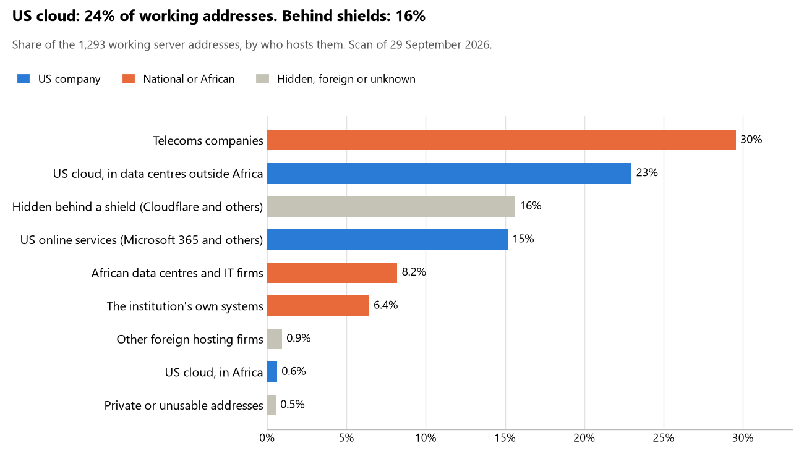

# Zimbabwe: who hosts the state's front door

29 September 2026 · Bill Anderson · scan of 29 September 2026

The scan covered 38 state bodies, banks and state-owned companies in Zimbabwe. 24% of their working server addresses are on US cloud: Amazon, Microsoft, Google or Oracle. 16% are behind shields such as Cloudflare, which hide the host. 6% are on government data centres or the institutions' own systems.

The scan found 989 web and mail names and 1,293 working addresses. 17 of the 38 institutions use US cloud for at least part of their estate. 16 use Microsoft for email and 1 use Google.

Of the 54 countries scanned so far, Zimbabwe has the 11th highest US cloud share (median 13%) and the 22nd highest share behind shields (median 12%).

## Where it lives

305 addresses are on US cloud. Where they are: 50% on worldwide delivery networks (no fixed location), 45% in Europe, 3% in Africa, 3% in a region the providers do not publish and <1% in North America.

202 addresses are behind shields: Cloudflare (68%), Akamai (16%) and Radware (8%). The host behind a shield cannot be seen, so the US cloud share is a minimum.

## Banks against government

| Share of working addresses | Government (29) | Banks (9) |
| --- | --- | --- |
| On US cloud | 24% | 22% |
| …of which in Africa | <1% | <1% |
| US online services (Microsoft 365 and others) | 9% | 23% |
| Behind a shield | 14% | 18% |
| Government data centres | 0% | 0% |
| Run by the institution itself | 7% | 5% |
| Telecoms companies | 38% | 18% |
| African data centres and IT firms | 6% | 12% |
| Other foreign hosting firms | <1% | <1% |

9 of 9 banks and 8 of 29 government bodies use US cloud somewhere. "Government" includes the central bank, the payment switch, the stock exchange and the state-owned companies.

## Email

16 of the 38 institutions use Microsoft 365 for email and 1 use Google.

- **Microsoft 365:** 16. Judicial Service Commission, Reserve Bank of Zimbabwe, CBZ Bank, FBC Bank, ZB Bank, Steward Bank, NMB Bank, First Capital Bank Zimbabwe, CABS, Nedbank Zimbabwe, Zimswitch, Securities and Exchange Commission of Zimbabwe, National Social Security Authority, Procurement Regulatory Authority of Zimbabwe, Zimbabwe Electricity Supply Authority and Postal and Telecommunications Regulatory Authority of Zimbabwe.
- **Google:** 1. Zimbabwe Stock Exchange.
- **Own mail servers:** 1. TelOne.
- **Telecoms companies (Telone PVT Ltd):** 11. Office of the President and Cabinet, Parliament of Zimbabwe, Ministry of Defence and War Veterans, Zimbabwe Republic Police, Ministry of Justice Legal and Parliamentary Affairs, Ministry of Home Affairs and Cultural Heritage, Zimbabwe National Statistics Agency, Department of Immigration, Ministry of Health and Child Care, Ministry of Public Service Labour and Social Welfare and Government Internet Service Provider (GISP).
- **African hosts (Xneelo):** 2. Ministry of Finance Economic Development and Investment Promotion and Zimbabwe Anti-Corruption Commission.
- **Behind a mail filter, provider not visible:** 2. Zimbabwe Revenue Authority and Zimbabwe Electoral Commission.
- **Not identified:** 4. Ministry of Foreign Affairs and International Trade, Registrar General of Zimbabwe, Ministry of Information Communication Technology Postal and Courier Services and Office of the Auditor-General of Zimbabwe.
- **No mail on the domain scanned:** 1. Stanbic Bank Zimbabwe.

## Institution by institution

Each figure is a share of that institution's working addresses. The rest are with telecoms companies, African data centres, US online services or foreign hosts. Rows follow the order of institution types.

| Institution | Type | On US cloud | …in Africa | Behind a shield | Own or government | Email |
| --- | --- | --- | --- | --- | --- | --- |
| Office of the President and Cabinet | Presidency | 0% | 0% | 0% | 0% | Telecoms |
| Parliament of Zimbabwe | Parliament | 0% | 0% | 45% | 0% | Telecoms |
| Ministry of Foreign Affairs and International Trade | Foreign Affairs | 0% | 0% | 0% | 0% | Not identified |
| Ministry of Defence and War Veterans | Defence | 0% | 0% | 0% | 0% | Telecoms |
| Zimbabwe Republic Police | Police | 0% | 0% | 0% | 0% | Telecoms |
| Ministry of Justice Legal and Parliamentary Affairs | Justice | 0% | 0% | 0% | 0% | Telecoms |
| Judicial Service Commission | Justice | 0% | 0% | 0% | 0% | Microsoft |
| Ministry of Finance Economic Development and Investment Promotion | Treasury / Finance | 0% | 0% | 92% | 0% | African host |
| Zimbabwe Revenue Authority | Revenue Service | 6% | 3% | 32% | 0% | Filtered |
| Ministry of Home Affairs and Cultural Heritage | Interior / Home Affairs | 0% | 0% | 0% | 0% | Telecoms |
| Reserve Bank of Zimbabwe | Central Bank | 38% | 0% | 26% | 0% | Microsoft |
| CBZ Bank | Commercial Banks | 17% | 2% | 16% | 0% | Microsoft |
| FBC Bank | Commercial Banks | 9% | 0% | 4% | 55% | Microsoft |
| ZB Bank | Commercial Banks | 11% | 0% | 4% | 0% | Microsoft |
| Stanbic Bank Zimbabwe | Commercial Banks | 34% | 0% | 59% | 0% | — |
| Steward Bank | Commercial Banks | 3% | 0% | 3% | 0% | Microsoft |
| NMB Bank | Commercial Banks | 44% | 0% | 3% | 0% | Microsoft |
| First Capital Bank Zimbabwe | Commercial Banks | 48% | 0% | 0% | 0% | Microsoft |
| CABS | Commercial Banks | 17% | 0% | 29% | 0% | Microsoft |
| Nedbank Zimbabwe | Commercial Banks | 21% | 11% | 0% | 0% | Microsoft |
| Registrar General of Zimbabwe | Civil registry / National ID authority | 0% | 0% | 0% | 0% | Not identified |
| Zimbabwe Electoral Commission | Electoral commission | 0% | 0% | 0% | 0% | Filtered |
| Zimbabwe National Statistics Agency | Statistics office | 0% | 0% | 18% | 0% | Telecoms |
| Department of Immigration | Immigration / Passports | 81% | 0% | 0% | 0% | Telecoms |
| Ministry of Health and Child Care | Health ministry / National health insurance | 0% | 0% | 0% | 0% | Telecoms |
| Ministry of Public Service Labour and Social Welfare | Social protection / Social registry | 0% | 0% | 0% | 0% | Telecoms |
| Zimswitch | National payment switch | 26% | 0% | 0% | 0% | Microsoft |
| Zimbabwe Stock Exchange | Stock exchange | 69% | <1% | 19% | 0% | Google |
| Securities and Exchange Commission of Zimbabwe | Securities regulator | 0% | 0% | 45% | 0% | Microsoft |
| National Social Security Authority | Sovereign wealth fund / National pension fund | 38% | 0% | 10% | 0% | Microsoft |
| Procurement Regulatory Authority of Zimbabwe | Public procurement authority | 23% | 2% | 0% | 0% | Microsoft |
| Zimbabwe Electricity Supply Authority | Energy utility | 0% | 0% | 0% | 0% | Microsoft |
| TelOne | State-owned telco / National backbone operator | 33% | 0% | 0% | 66% | Own servers |
| Ministry of Information Communication Technology Postal and Courier Services | E-government agency | 0% | 0% | 0% | 0% | Not identified |
| Government Internet Service Provider (GISP) | National data centre / Government cloud operator | 0% | 0% | 0% | 0% | Telecoms |
| Postal and Telecommunications Regulatory Authority of Zimbabwe | Communications regulator | 0% | 0% | 20% | 0% | Microsoft |
| Office of the Auditor-General of Zimbabwe | Audit office | 0% | 0% | 0% | 0% | Not identified |
| Zimbabwe Anti-Corruption Commission | Anti-corruption commission | 0% | 0% | 17% | 0% | African host |

No institution or working domain was found for 7 of the 36 types: Armed Forces, Customs, Intelligence, Data protection authority, Land registry, Ports authority and Cybersecurity agency / National CERT.

## What stood out

- **Most on US cloud.** Department of Immigration (81%) and Zimbabwe Stock Exchange (69%) have more than half their working addresses on US cloud.
- **Little US cloud in Africa.** 3% of Zimbabwe's US cloud addresses are in the providers' African data centres.
- **Core state bodies on foreign hosting firms.** Parliament of Zimbabwe (Telehouse EAD) and Judicial Service Commission (Contabo Inc. and Contabo).
- **No Chinese cloud.** The scan found no address on Huawei, Alibaba or Tencent cloud.

## What this can and cannot tell you

The scan sees only the front door: websites, email, login portals, remote-access gateways and online banking. It cannot see where a bank's core ledger, the ID register or the payroll run.

- **Every US figure is a minimum.** Anything behind a shield or a mail filter could also be on US cloud. In Zimbabwe that is 16% of working addresses.
- **It counts addresses, not importance.** An institution with many test and marketing sites weighs more than one with few.
- **The list of institutions was drawn up for this scan.** Each domain was checked to exist, not confirmed as the institution's main one.
- **It is a snapshot.** Every figure is as of 29 September 2026.
- **Nothing was touched.** The scan used public address lookups, public certificate records and the cloud companies' published address lists. It never connected to any institution's systems.

The data and method are in `R&D/Hyperscaler-dependence/scan/ZWE/` and `R&D/Hyperscaler-dependence/HYPERSCALER-SCAN.md` in the Corpus repository.
